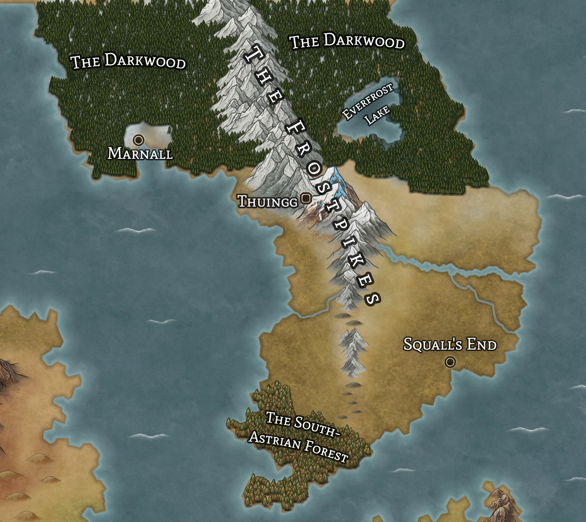

# Astria

__Major Cities:__

- [Squall's End](squalls-end.md)
- [Marnall](marnall.md)

## Society

- Astria is known for being incredibly closed off from the rest of [Vodenz](../vodenz.md).  
- They only trade with a few locations, and only with trusted companies
- Entry into Astria is forbidden without approval from _The Shipyard_ or an immediate member of the royal family.

## Flora and Fauna

- The flora and fauna are the least studied from any on [Vodenz](../vodenz.md), mostly due to travel restrictions
- Only recently were any outsiders allowed in to study the Southern forest
  - Research has shown it to be older than any forests on the mainland
- Many scholars speculate that the _Darkwood_ is even more ancient than the Southern forest, but this has yet to be proven with any definitive evidence.

## International Relations

- __Allies__
  - [Laza](../laza/README.md)
  - [Syre](../syre/README.md)
  - __The Dwarven Independant States__
- __Enemies__
  - [Kraina](../kraina/README.md)
- __Neutral__
  - [Doria](../doria/README.md)
  - [Rohumaad](../rohumaad/README.md)
  - [Triia and Tarna](../triia-and-tarna/README.md)
