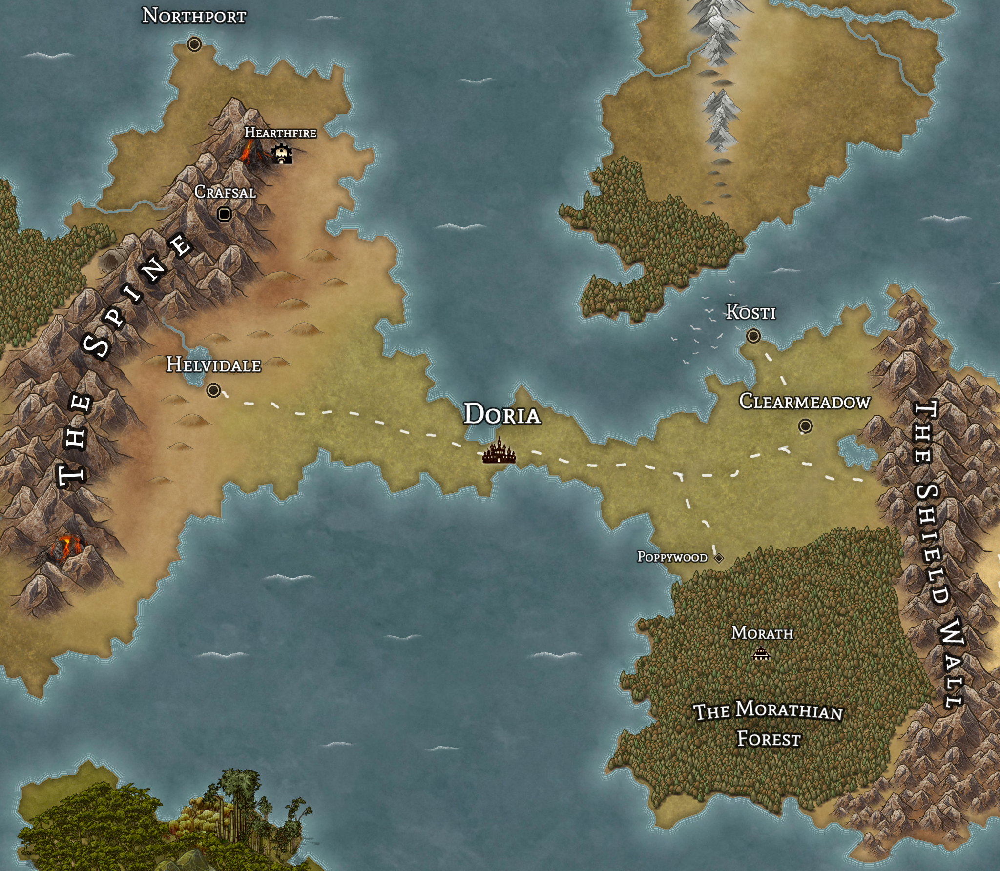
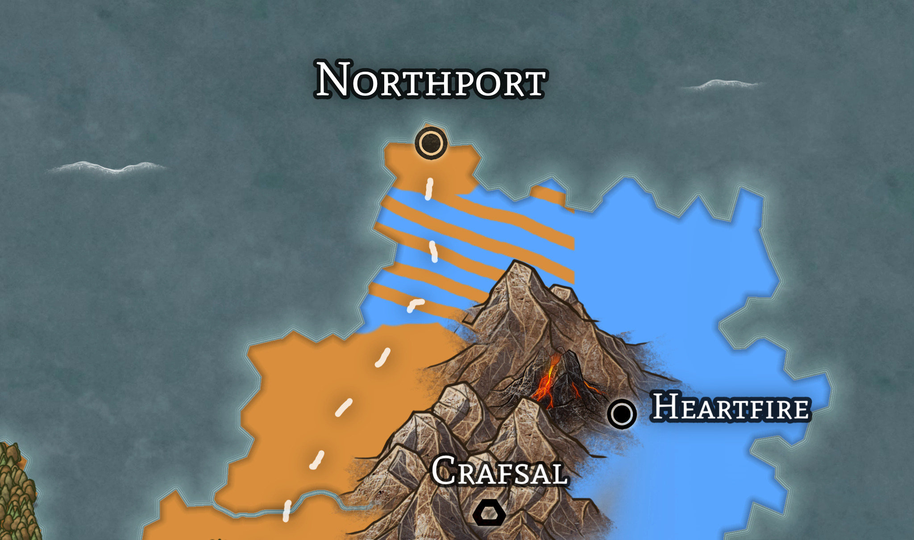

# Doria

## Overview

(_This is for the nation, for the City see [Doria (City)](doria-city.md)_)

The central-most nation in [Vodenz](../vodenz.md), with the largest overall landmass and highest population

- Government: Oligarchy
- Capital: [Doria](doria-city.md)
- Major Cities:
  - [Helvidale](helvidale.md)
  - [Kosti](kosti.md)
  - [Hearthfire](hearthfire.md)
- Other Cities:
  - [North Helvid](north-helvid.md)

## The Council

- 50 members of the council exist
- Members are only replaced on death or resignation, and only if the current members vote them in
- Exceptions are 11 positions that come with appointments:
  - North Union Master
  - South Union Master
  - Chief Admiral
  - Commander of the Army
  - Head of The Dorian Bank
  - Mayor of Helvidale
  - Mayor of Kosti
  - Mayor of Clearmeadow
  - Mayor of Hearthfire
  - Dean of The University of Helvid
  - Dean of The University of Doria

## International Relations

- __Allies__
  - [Triia and Tarna](../triia-and-tarna/README.md)
    - Doria has a long history of working with the college, and they often have similar political interests.
      - As Doria lacks a true mage college and the cities lack a proper army, they often will help each other in conflict
  - [Laza](../laza/README.md)
    - Because much of laza is forested, they lack significant landspace to grow grains, which they import heavily from Doria.
    - Doria has been the primary supporter in helping to fight of _The Scourge_, having especially good ties to Khut'ri, who houses a large garrison of Dorian Troops.
- __Enemies__
  - [Syre](../syre/README.md)
    - Doria attacked and took the Morathian Forest from Syre 38 Years ago
  - [Rohumaad](../rohumaad/README.md)
    - At war with Rohumaad over the __Talisk__ region, which encoumpases the land North of The Spine (_see map below_)
- __Neutral__
  - [Astria](../astria/README.md)
  - [Kraina](../kraina/README.md)
  - __The Independant Dwarven States__

