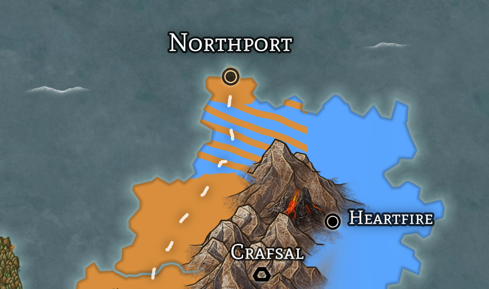

# Rohumaad

## Overview

- Government: Elective Monarchy
  - Current Ruler: Queen Astrid Erva
- Capital: [Locria](locria.md)
- Major Cities:
  - [Ionia](ionia.md)
  - [Leywood](leywood.md)
  - [Stonehill](stonehill.md)
- Other Cities:
  - [Blackberry Falls](blackberry-falls.md)
  - [Angrove](angrove.md)

### Geography

Located on the Western coast of the mainland, Rohumaad is one of the most diverse nations in Vodenz.The most self-sufficient nation, it houses one of the largest shipping industries.  With its two major forests, it also has the largest lumber industry in all of Vodenz, contributing most of the imports to western Doria, Triia and Tarna, and parts of Kraina. The floodplains south of the lake are where most of the agriculture within Rohumaad is grown, and supplies the two largest cities (Locria and Stonehill).

## International Relations

- __Allies__
  - [Kraina](../kraina/README.md)
  - [Syre](../syre/README.md)
- __Enemies__
  - [Doria](../doria/README.md)
    - At war with Doria over the __Talisk__ region, which encoumpases the land North of The Spine
- __Neutral__
  - [Astria](../astria/README.md)
  - [Laza](../laza/README.md)
  - [Triia and Tarna](../triia-and-tarna/README.md)
    - Tense Neutral Relationship
  - __The Dwarven Independant States__

